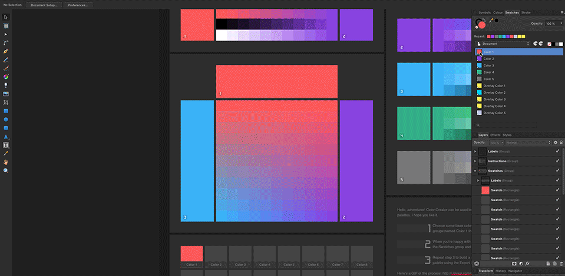

# Using the Affinity Designer template

The Color Creator Affinity Designer template can be used to explore color variations, and build nice color palettes. It works by providing blending options that aren’t normally found in color pickers in design tools — blending between two or three custom colours, or blending using a blending mode (overlay is used by default, but you can change it if you’d like).

It generates lots of variations that can be used to build your color palette.

The base colors can be changed by editing the layers named __Color 1__ inside the __Color 1__ folder, __Color 2__ inside the __Color 2__ folder etc. When you’ve chosen some base colors you’re happy with, select a Swatch layer in the Swatches group and fill it with a color picked from the canvas — this can be done by double clicking the layer thumbnail in the layers panel, then click on the canvas to pick a blended color.

The base colors can be changed by editing the layer effects on the groups named __Color 1__ inside the __Color 1__ group folder etc. When you’re happy with the base colors, select a Swatch layer in the Swatches group and fill it with a color from the canvas. Repeat step 2 to build a nice color palette.

You can export the palette using the __Swatches__ slice in the Export Persona, to share it with others.

### Why not use symbols?

Symbols seemed like a good fit for the creation of this document — it should be possible to use a symbol for each color, and edit it to propagate changes across the entire document. I attempted it a few times, but encountered some show-stopper bugs and eventually gave up for the initial release. I will revisit using symbols in the future!