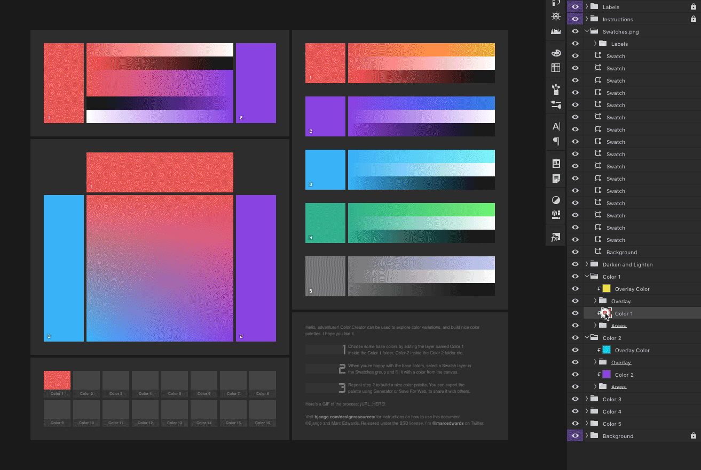
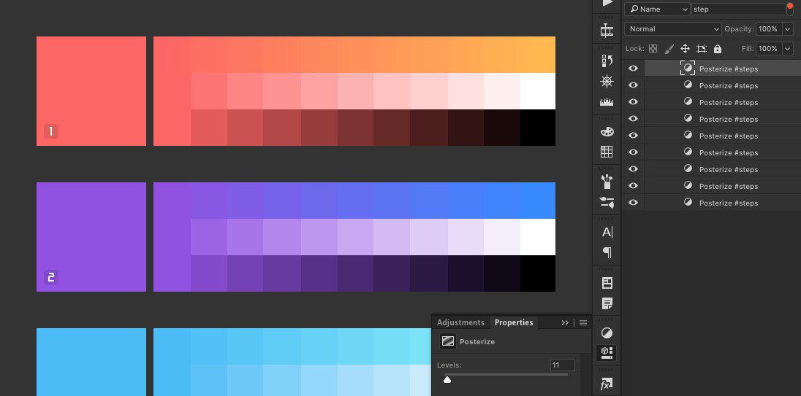

# Using the Photoshop template

The Color Creator Photoshop template can be used to explore color variations, and build nice color palettes. It works by providing blending options that aren’t normally found in color pickers in design tools — blending between two or three custom colours, or blending using a blending mode (overlay is used by default, but you can change it if you’d like).

It generates lots of variations that can be used to build your color palette.

The base colors can be changed by editing the layers named __Color 1__ inside the __Color 1__ folder, __Color 2__ inside the __Color 2__ folder etc. When you’ve chosen some base colors you’re happy with, select a Swatch layer in the Swatches group and fill it with a color picked from the canvas — this can be done by double clicking the layer thumbnail in the layers panel, then click on the canvas to pick a blended color.

You can export the palette using Generator or Save For Web, to share it with others.

### Gradient steps

The Photoshop Color Creator templates include posterize adjustment layers that control how many steps are used in the gradients. The layers are turned off by default, because they make the document slow to use, and because (maybe?) a smooth transition is nicer. If you’d like to quickly turn them on, or alter the number of steps in the gradients, please search for “#steps”.

