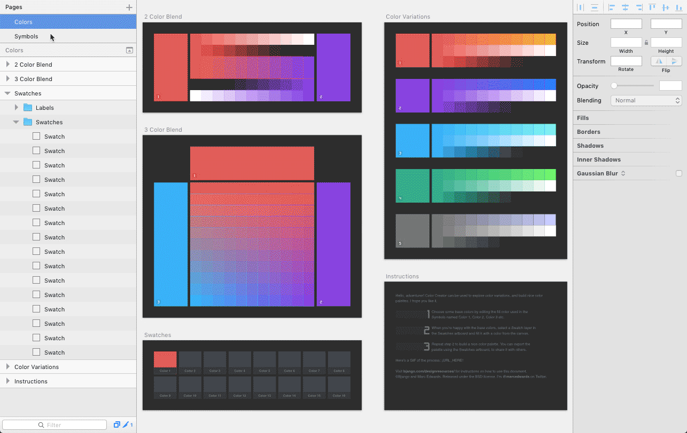

# Using the Sketch template

The Color Creator Sketch template can be used to explore color variations, and build nice color palettes. It works by providing blending options that aren’t normally found in color pickers in design tools — blending between two or three custom colours, or blending using a blending mode (overlay is used by default, but you can change it if you’d like).

It generates lots of variations that can be used to build your color palette.

The base colors can be changed by editing the fill color used in the Symbols named __Color 1__, __Color 2__, __Color 3__ etc. When you’re happy with the base colors, select a Swatch layer in the Swatches artboard and fill it with a color from the canvas. Repeat step 2 to build a nice color palette.

You can export the palette using the Swatches artboard, to share it with others.

