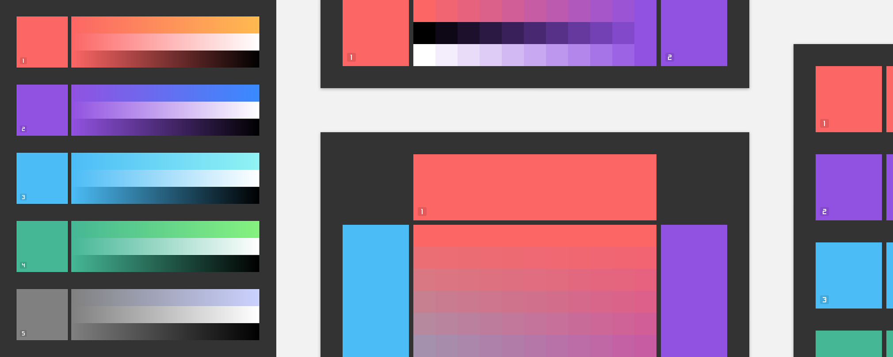

# Bjango Color Creator Templates

The [Bjango Color Creator Templates](https://bjango.com/designresources/) are a set of Photoshop, Sketch and Affinity Designer documents that use base colors to generate larger palettes. It’s a bit like an advanced color picker, in the form of a document. All free and open source, released under the [BSD license](https://github.com/bjango/Bjango-Templates/blob/master/Help/License.md).

**Download:** **[Bjango Color Creator Templates](https://github.com/bjango/Color-Creator/archive/master.zip)** — 1.0 ([version history](https://github.com/bjango/Color-Creator/blob/master/Help/Version%20History.md))

-----

### Help

- Hold on, help is on the way!

```
        :::::::::   :::::::     ::::      ::::    :::   ::::::::    :::::::: 
       :+:    :+:      :+:    :+: :+:    :+:+:   :+:  :+:    :+:  :+:    :+: 
      +:+    +:+      +:+   +:+   +:+   :+:+:+  +:+  +:+         +:+    +:+  
     +#++:++#+       +#+  +#++:++#++:  +#+ +:+ +#+  :#:         +#+    +:+   
    +#+    +#+      +#+  +#+     +#+  +#+  +#+#+#  +#+   +#+#  +#+    +#+    
   #+#    #+#  #+# #+#  #+#     #+#  #+#   #+#+#  #+#    #+#  #+#    #+#     
  #########    #####   ###     ###  ###    ####   ########    ########       
```
